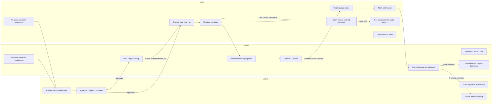
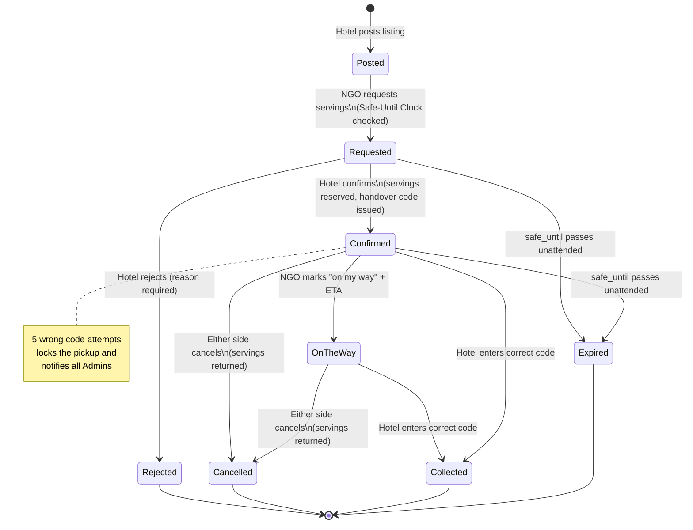
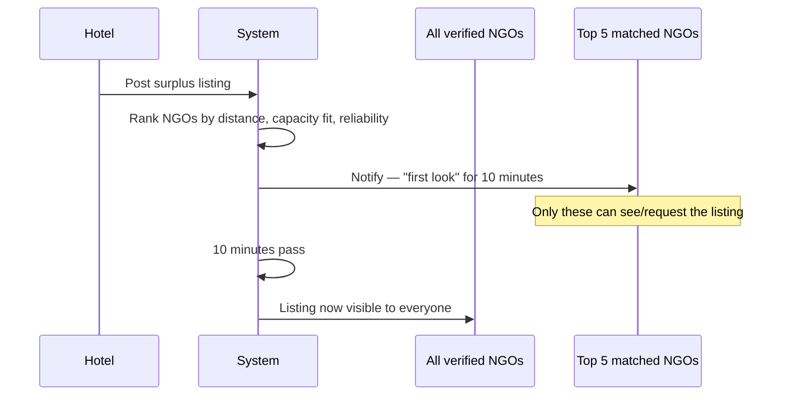
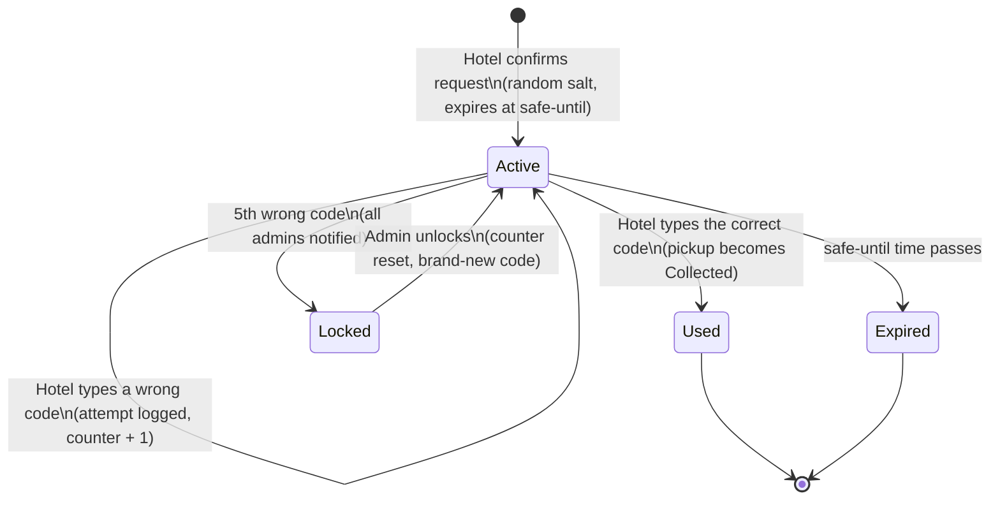

# FoodBridge — Use-Case & Flow Diagram

## Use-case overview

```mermaid
flowchart LR
    subgraph Hotel
        H1[Register & wait for verification]
        H2[Post surplus listing]
        H3[Review incoming requests]
        H4[Confirm / Decline]
        H5[Confirm handover with code]
        H6[Repost / Cancel / Edit]
        H7[View history & Impact Certificate]
    end

    subgraph NGO
        N1[Register & wait for verification]
        N2[Browse food near me]
        N3[Request servings]
        N4[Track pickup status]
        N5[Mark on the way]
        N6[Show pickup code at handover]
        N8[Get a replacement code - max 2]
        N7[Post / close a need]
    end

    subgraph Admin
        A1[Review verification queue]
        A2[Approve / Reject / Suspend]
        A3[View reports & activity log]
        A4[Unlock a locked pickup]
    end

    H1 --> A1
    N1 --> A1
    A1 --> A2
    A2 -->|approved| H2
    A2 -->|approved| N2
    H2 -->|Smart Match ranks NGOs| N2
    N2 --> N3
    N3 -->|Safe-Until Clock check| N3
    N3 --> H3
    H3 --> H4
    H4 -->|confirmed: code issued| N4
    N4 --> N5
    N5 --> H5
    H5 -->|code matches| H7
    H5 -->|5 wrong attempts| A4
    N6 -.->|code lost| N8
```

## Pickup lifecycle (the live tracker)

```mermaid
stateDiagram-v2
    [*] --> Posted: Hotel posts listing
    Posted --> Requested: NGO requests servings\n(Safe-Until Clock checked)
    Requested --> Confirmed: Hotel confirms\n(servings reserved, handover code issued)
    Requested --> Rejected: Hotel rejects (reason required)
    Confirmed --> OnTheWay: NGO marks "on my way" + ETA
    Confirmed --> Cancelled: Either side cancels\n(servings returned)
    OnTheWay --> Cancelled: Either side cancels\n(servings returned)
    OnTheWay --> Collected: Hotel enters correct code
    Confirmed --> Collected: Hotel enters correct code
    Requested --> Expired: safe_until passes unattended
    Confirmed --> Expired: safe_until passes unattended
    Rejected --> [*]
    Cancelled --> [*]
    Collected --> [*]
    Expired --> [*]

    note right of Confirmed
        5 wrong code attempts
        locks the pickup and
        notifies all Admins
    end note
```

## Smart Match (first-look window)

```mermaid
sequenceDiagram
    participant Hotel
    participant System
    participant NGOs as All verified NGOs
    participant TopNGOs as Top 5 matched NGOs

    Hotel->>System: Post surplus listing
    System->>System: Rank NGOs by distance, capacity fit, reliability
    System->>TopNGOs: Notify — "first look" for 10 minutes
    Note over TopNGOs: Only these can see/request the listing
    System->>System: 10 minutes pass
    System->>NGOs: Listing now visible to everyone
```

## Handover code (security) states

```mermaid
stateDiagram-v2
    [*] --> Active: Hotel confirms request\n(random salt, expires at safe-until)
    Active --> Active: NGO asks for a new code (max 2)\nwrong-guess counter kept
    Active --> Active: Hotel types a wrong code\n(attempt logged, counter + 1)
    Active --> Used: Hotel types the correct code\n(pickup becomes Collected)
    Active --> Locked: 5th wrong code\n(all admins notified)
    Locked --> Active: Admin unlocks\n(counter reset, brand-new code)
    Active --> Expired: safe-until time passes
    Used --> [*]
    Expired --> [*]
```
